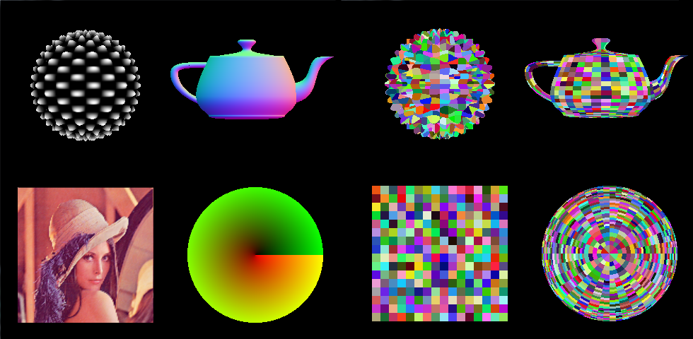
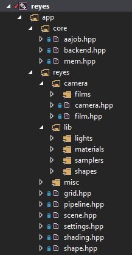

# reyes
reyes renderer

current version v2.2

###TODO

####v1.0 rock

- ~~basic buffer (1 sample per pixel)~~
- ~~no bucketing~~
- ~~no splitting and bounding (dice entire primitives, each and every)~~
- ~~basic pipeline~~
- ~~basic rasterizer~~

####v2.0 dragonfly

- ~~transformations (translate, scale)~~
- ~~dicing~~
- ~~bounding and splitting~~
- ~~entire reyes pipeline~~
- ~~finalize quadrilaterals and triangles~~
- ~~G-buffer~~
- ~~improved memory management and speed~~
- ~~geometry: plane, sphere, disc, cubic bezier patch, Utah teapot~~
- ~~materials~~
- ~~samplers~~
- ~~lights: directional, point~~

####v3.0 nautilus

- ~~threaded renderer~~
- ~~even better memory managment~~
- A-buffer
    - *stochastic (multi)sampling*
    - transparency support
    - inject optimizations
- dof
- motion blur
- ~~task (job) manager~~
- profiling
- bucketing
- (progress indicator)
- (camera; perspective and orthographic)
- (Klein bottle)
- (SH light)

####v4.0 cheetah

- optimized memory layout
- (GP)GPU implementation
- (pseudo) real-time

####v5.0 alien

- fix cracks (no need?)
- fix elongated micropolygons
- dice criterium different
- dynamic dicing

####v6.0 bambi (totally irrelevant)

- shadow mapping
- extra
    - additional post-processing effects
- animation
- materials (toon, phong, ggxD)
- additional geometry
    - catmull-clark subdiv
    - more bezier
    - nurbs (b-spline)
    - loop subdiv
- ~~shading language~~ (***needs to be more flexible***)

####v113A

- full Renderman specification :D

####challenge

- normal-mapped, textured cube

###Source

Source code is divided as following:

- **core/**: responsible for systems independent of the reyes algorithm
	- aajob.hpp: multithreading management
	- backend.hpp: win api and opengl init
	- mem.hpp: memory management
- **reyes/**
	- settings.hpp: modifies behavior and data structures
	- pipeline.hpp: main rendering procedure and heart of the system
	- shape.hpp: main abstraction of the input
	- shading.hpp: abstraction of a material and shading system
	- grid.hpp: microgrid abstraction
	- scene.hpp: convenient data structure
	- **camera/**
		- camera.hpp: abstraction of the virtual camera
		- film.hpp: abstraction of the image's film
		- **film/**: different implementations of the film
	- **lib/**: different implementations of the core parts of the shading system
		- **lights/**
		- **materials/**
		- **samplers/**
		- **shapes/**
	- **misc/**: vector math and matrices
