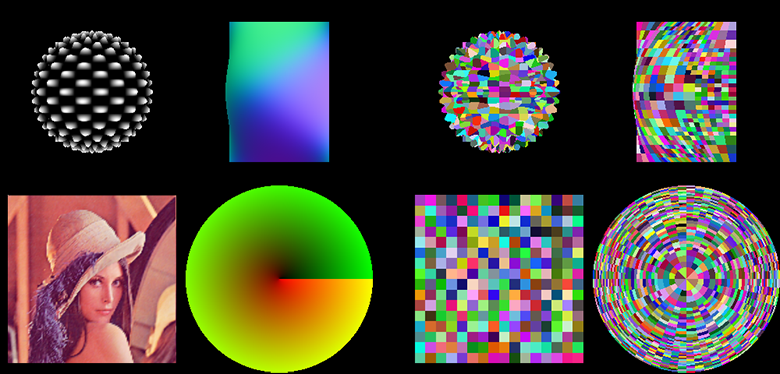

# reyes
reyes renderer

current version v1.95

###TODO

####v1.0

- ~~basic buffer (1 sample per pixel)~~
- ~~no bucketing~~
- ~~orthographic camera~~
- ~~no splitting and bounding (dice entire primitives, each and every)~~
- ~~basic pipeline~~
- ~~basic rasterizer~~

####v2.0

- camera (perspective and orthographic)
- ~~transformations (translate, rotate, scale)~~
- ~~dicing~~
- ~~bounding and splitting~~
- ~~entire reyes pipeline~~
- ~~finalize quadrilaterals and triangles~~
- ~~G-buffer~~
- ~~improved memory management and speed~~
- ~~geometry (plane, sphere, disc, cubic bezier patch)~~
- ~~shading~~
    - ~~materials (lambert, normal, depth, uv, solid, textured)~~
    - ~~samplers (bmp texture, func. eval.)~~
    - ~~lights (directional, point)~~

####v3.0

- threaded renderer
- perf
    - profiling
    - progress indicator
    - progressive (~~rendering in a window~~)
- even better memory managment
- shadow mapping
- Klein bottle
- Newell teapot
- SH light
- more advanced rasterizer (?) (z-index arc)
- dof
- motion blur
- A-buffer
    - transparency support
    - inject optimizations
    - multisample buffer
- materials (toon, phong, ggxD)
- extra
    - additional post-processing effects

####v4.0

- fix cracks (no need?)
- fix elongated micropolygons
- additional geometry
    - catmull-clark subdiv
    - more bezier
    - nurbs (b-spline)
    - loop subdiv

####v5.0 

- bucketing
- task (job) manager

####v6.0

- (GP)GPU implementation
- job affinity selection
- (pseudo) real-time

####v7.0

- animation
- ~~shading language~~ (***needs to be more flexible***)

####v113A

- full Renderman specification :D

####challenge

- normal-mapped, textured cube