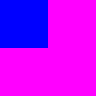
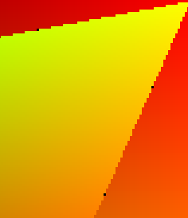
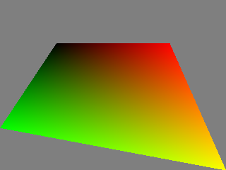
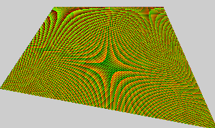
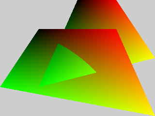
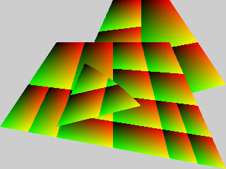
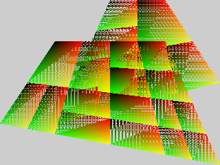
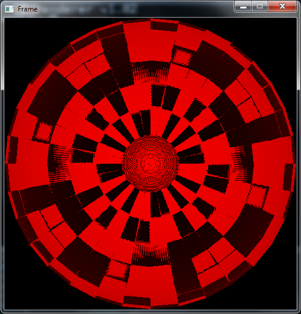
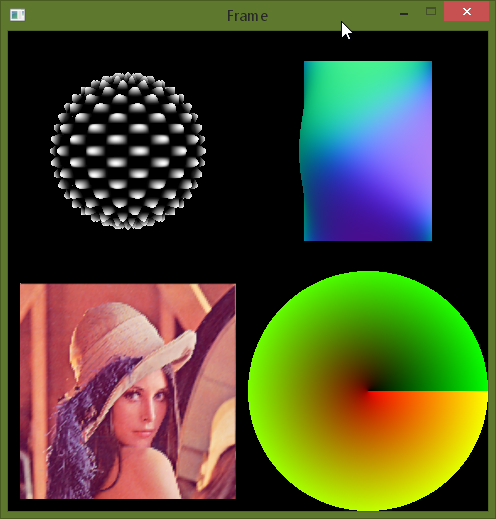
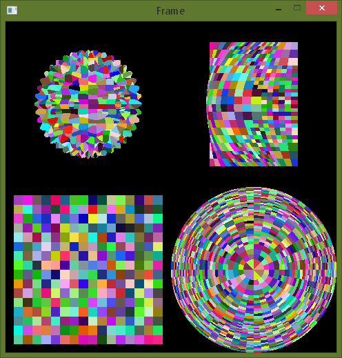

This log serves a purpose of reminding myself of some of the problems that I faced, frustrations that kept wake at night and how I handled/managed them. Log wasn't started immediately as the project did, but it's late a few days.

***Dec 3, 2015***
---

First rendered image.

I will also soon discuss some of the issues that I came along during the initial effort to build a pipeline, new realizations and problems that weren't initially planned. Yet, I'm pretty happy to see the thing displayed, even though it was a master cheat to get that image. Image is actually 10x10, there is practically no camera, no projection, no bound-split, not even a real dicing. No shaders. Only quarter of parallel quadrilateral (blue) is visible. I said it was a cheat. :D

So, v1.0 us out. I've modified goals in a readme.

***on inverse interpolation:*** While I was thinking about rasterization, I needed some way of getting interpolated attributes for a given point in space. So this is the problem: the primitive is ignorant of the rasterization that will happen on it. And the Image is responsible for generating samples (some Image might generate only one sample, while anti-aliased buffers will try to generate many samples). In conclusion, it is the Image that will generate sample points, and therefore I need some way of getting a color for a generated sample. So, I need piece of code that will input a Primitive (or the Shape that is made of bunch of Primitives) and a sample point (location), and the output would be a color of the Primitive at that location (interpolated value). I currently plan three basic Primitives: quadrilaterals, triangles and polygons. So for each of those, I need inverse interpolation function. [Shadertoy - quadrilateral interpolation](https://www.shadertoy.com/view/ldt3Wr) is the toy that I made, with my own version of the method (which is wrong and introduces UV seams), but later got corrected by Inigo Quilez how to do it properly. Entire code is on the Shadertoy. So, quadrilaterals are good. I also found [inverse barycentric](http://ofekshilon.com/2013/01/21/geometric-inverse-application-1-barycentric-coordinates/) article. I'll throw another Shadertoy example soon ([inverse barycentric](https://www.shadertoy.com/view/4d3GDH).

---

***on reyes:*** Figuring out the REYES was a fun ride. It took me a while to see what is the pipeline, what are the required functions, what are the pros and cons of the REYES over simple rasterization and pathtracing. So, where does reyes fit into rendering strategies?

REYES is rasterization algorithm. One things that is good at - adaptive tessellation. Like it's presented in the "reyes architecture and implementation" slides in the papers folder, the usual, uniform tessellation of the primitives often leads to problem of over-tessellation or under-tessellation (I have no idea if these are valid words). So REYES' pipeline is built on "screen-space tessellation". It bounds shape, approximates its dimensions, and splits if needed to reach a threshold. The goal of splitting to some threshold is to be memory-friendly, mostly. Eventually, the shape will be diced, i.e. cut, into small, tiny, tiny chunks, called micropolygons. Micropolygons are polygons that are around or under 1px size (area or diameter). Dicing entire shape into micropolygons without bound-split would leave us with massive amounts of micropolygons in memory. Also, dicing the shape into bunch of micropoygons is like super highres uniform tessellation, and we already concluded that's not always the best way to go about rendering. So bound-split servers a purpose of adaptive tessellation estimation, and dicing is there to actually tessellate the final, split parts of the shape.

So, bound-split and dicing, all good. We've adaptively tessellated our shape by splitting it into smaller parts of it, and then we uniformly tessellated those parts. What's left are microgrids of micropolygons.

Next step is shading. Micrpolygons are so small, that they are 1px in size, they are like fragments (from fragments shader). We can shade. Just points inside the microgrid, and interpolate colors across the micropolygon.

Final step is sampling, aka rasterization. It is very much like traditional rasterization where pipeline would generate sampling points, the primitives (micropolygons) are sampled at those points and everything is accumulated in the color buffer.

One neat things is bucketing. We can subdivide screen into smaller regions and go through them independently. On the slides previously mentioned, they also mention that storing microgrids is not very memory-efficient neither is holding entire color buffer. So we can just do things in chunks, which is good.

***Dec 5, 2015***
---

***intro Catmull-Clark:*** Started looking into additional surfaces, just thinking about them, and how would I later maybe implement them. More specifically, Catmull-Clark subdivision surfaces. Their algorithm is very simple and straight-forward and can be found on [Wikipedia](https://en.wikipedia.org/wiki/Catmull%E2%80%93Clark_subdivision_surface). These surfaces, by my understanding are used to just coarsely define the geometry, but then can refined as much as we want. They are procedural surfaces, in a way that they do not have finite resolution, but are represented through a few parameters (control points, i.e. faces and vertices). I am neither familiar with the math involved, all the magic numbers and reasons why things work the way they work, nor other similar parametric surfaces like NURBS, Bezier surfaces... I also don't quite understand advantages of one surface representation over another, problems that it might have and any additional mathematical pro/con (derivatives for example etc). I have basic understanding of those, but I am nowhere near expert so I guess I'd just have to take things for granted for now. Even so, they fir nicely with reyes' pipeline. I can imagine taking a Catmull-Clark surface, splitting it and refining until reaching a subpixel size for the primitives. I've created a separate repo for Catmull-Clark tests, but I'll try and integrate them into reyes' asap.

***reyes caveats:*** cracks, displacement caution while bound-split phase, non-proportional micropolygons, parallel execution of stages (good read at [papers/parallel_upoly_rendering.pdf](../papers/parallel_upoly_rendering.pdf))

***Dec 9, 2015***
---

***pixel cracks:*** while I was trying out rasterizer and playing with UVs and quads, I noticed these cracks:

It didn't seem logical at all, it was rare. But I noticed it's always edge pixels, and those that are extremely close to not being rasterized at all. I remembered to add a half-pixel offset, so I actually end up checking for center of the pixel instead of it's top-left corner. That was a quick fix. Then I renderer a rectangle and got this:

It seems like UV wrapped around. So I <i>really carefully</i> adjusted those half-pixel offsets (X and Y offsets have different sings because axes grow in different directions when compared to screen axes). Note to myself: be careful.

After all the hassle, here's the pixel-cracks-free and the-right-UV-mapped quadrilateral. :)

---

interesting but wrong (notice arced intersection on the right)

 

***Dec 10, 2015***
---

Pipeline with split-bound, and dicing, and shading, and sampling, is finally there!

I had serious problems with memory management, which I think are now fixed. All memory allocations are done through custom allocators, which are tested if they were manually cleared, and everything seems good (even I use malloc() basically, but I keep track of all allocations). Pipeline is tiny bit interleaved, meaning, it's not going one stage at the time, but instead, some data is shared between the stages. Overall, I'm pretty happy with the outcome. :)

One thing that I noticed - it's slow as hell. Like, very slow! One thing that I'm sure I'm not doing well is cache coherency, because there is none. All allocations are still mallocs practically, so I will need to work on that some time in the future, for now, I'm just happy that I don't have memory leaks. Second thing that is slow is rasterization. For every primitive there is, I rasterize it over entire image surface. Optimizations towards generating smaller regions that need to be rasterized are for some future version, it's not currently a big concern. There's also where bucketing and bounding boxes come into play, so everything has good locality.

Next in line are transformations. I hate the 3D math and matrices, tbh. Even so, it will be much easier once I enable transformations and cameras.

---

more "interesting but wrong" images during debugging

 

---

***rasterization:*** I've updated the rasterization code so the primitive doesn't get rasterized over entire image surface, but just the bounding box of it. The speedup is enormous! I put a threshold to 2x2, and it was rendering two quads for several minutes, and with this approach, it is practically just a few <i>waitable</i> second. Great stuff.

***Dec 12, 2015***
---

***on importance of a todo list and obvious progress:*** It has proved to be one of the most important thing while working on a project. Don't hold it in your head. Write it out, prioritize and update over time. It really helps you out narrow down the specific problem that you need to focus on in order to make further progress. These lists mean that you need to write out all your plans. But also, order them by their importance and urgency. It is much easier to just take a quick look at what's left after you're done with some part of the project, and it also immediately tells you what is next. There's also a problem of thinking in advance. For example, I wanted to build a rasterizer, but I know that some time in the future I would probably tackle its GPGPU version, so I while I was implementing the very basic CPu version, I was still thinking about the design in the future. Well, don't do that. It is very important to make some progress, it really builds your confidence when you settle one thing down and move onto the next. You get the feeling of doing good and making practical and visible changes. So, better implement something in a trivial manner, and later, when you come at the point you need to improve that part, do it then, not before. You might ask why the heck is better to come at the point where you need to refactor bunch of your code because you want to improve something, even though refactoring might have been avoided by thinking more in advance? But by the time you get to that point of refactoring, you already created all the other subsystems, that are proven to be working, that are checked. Refactoring means remodeling, but it is much more important that you have the FUNCTIONALITY. Your things work, but they are just ugly and don't fit into current plans. But they work!! It is absolutely great and relaxing when you know that your code works, but you need to change its interface or similar. To sum up, you create your todo, so you don't have to hold it all in your head. With that list, you can easily see what's next problem that you should solve, and you would notice the progress. Recognizing that progress exists means more energy and will to continue working and means happier worker (you). Focus on one problem at the time and devote your life's energy to one particular problem/part of the problem, and you'll progress faster.

Concretely in my case of a reyes, I've made a mistake, but later learned a bit more about how to organize myself. For example, I started with templates, because I tried abstracting things too much, for example the shading language that I might implement some time later. That shading language was put as the (literally) last feature on my list. Yet I had some basic support for that even before I rendered my first image.

I believe it is okay to implement something planned for later iteration of your code if you think it might boost your productivity for other parts. For example, I decided to write openGL previewer for rendered images because I thought that it would be much better to have it that way than opening PPM image every single time in Photoshop. So even though I didn't need that previewer, I concluded that feature would help me more than it would hurt me (by spending time working on a feature that doesn't HAVE to exist and was planned for much later).

Build todo list, prepare yourself as much as you can, but as you're working, you'll notice that you made mistakes, or wrong assumptions or you're missing stuff. So update your list, and rearrange your features again and always have a very clear idea what is next problem that you'll be working on.

***Dec 16, 2015***
---

A lot of code started falling apart, mostly because of the templates, and I didn't want to bother. I rewrote the entire thing once again. There is now literally only one place with templates - material.

***on splitting:*** I noticed something strange when working with Disc surface. U coordinate goes around the disc's outer edge, while V coordinate goes between center and outer edge. But funny thing happens when you try to split. If the width of the patch is too big, the cut will go along the V axis and you'd get two new patches, one smaller and one still the same width as the one we started with! Infinite recursion, and we run out of memory. One way to go around the issue, to check if our newly made patches are indeed smaller than the original patch, if not, then split along other axis. Another thing that came to my mind is that we cannot just split along U/V based on the XY raster size. It's different coordinate system. Different coordinate system requires some kind of Jacobian matrix or so to be included in the calculations so things can go well. It's just not the same. I need to work on that. I also noticed this happening with spheres. With rectangle, there's no chance of that happening. I am not sure how to directly predict will it happen or not, there probably is some rule.

***Dec 21, 2015***
---

One way to solve the splitting issue and be sure that the right dimension's size was reduced is to always split along both axis at the same time. This approach ensures that the size of the path will get smaller, but also leads to unnecessary over-splitting in some areas. I'm not happy with that. Another way would be to split along both axis, but then check which split was more helpful for faster convergence to desired raster size, then pick only that split. This is computationally costly, obviously, because you do two splits but completely ditch one. Not too happy with that one either.

Another big problem are precision issues (or something that looks like it). Wrong values, wrapping of the values, boundaries at pixel center, a lot of artifacts come from what seems to be a precision issue. I will probably later try to simply switch to double and hope for the best, but even float should be sufficient, so I'm a bit confused.

UPDATE: I've solved the precision issue, or whatever it is by completely ditching my CPU rasterizer. I've swapped it with GPU rasterizer (running OGL 1.x, proudly), so I can get moving more faster, and I'll get back to CPU rasterizer later. I am even thinking about abandoning the idea of CPU rasterization and doing even A-buffer version on GPU. Well, at least until I figure what the heck is wrong with the code, even though I think it's alright even now, but it obviously isn't.

***Dec 23, 2015***
---

Oh my God, that took a while. Reverse Z coordinate, re-clearing framebuffer after every rasterized primitive and ogl clipping were the "mistakes". Neither of those was really semantic error, but they oversaw some very simple and obvious assumptions. And I has serious problems with sphere geometry, and I'm yet to fix Klein bottle geometry. Here's one of the images during very long (several days) debug session.

***Dec 24, 2015***
---

Some of the transformations are working. I mean, they all are working, but I'm definitely too lazy to make sure 100% that they are correct and all that, but it seems fine. I managed to avoid cameras and matrices (still!). I am pretty happy with how things are going.

Here's the image of the displaced sphere, cubic bezier patch, textured rectangle and uv-colored disc. Second image shows corresponding patches.

 